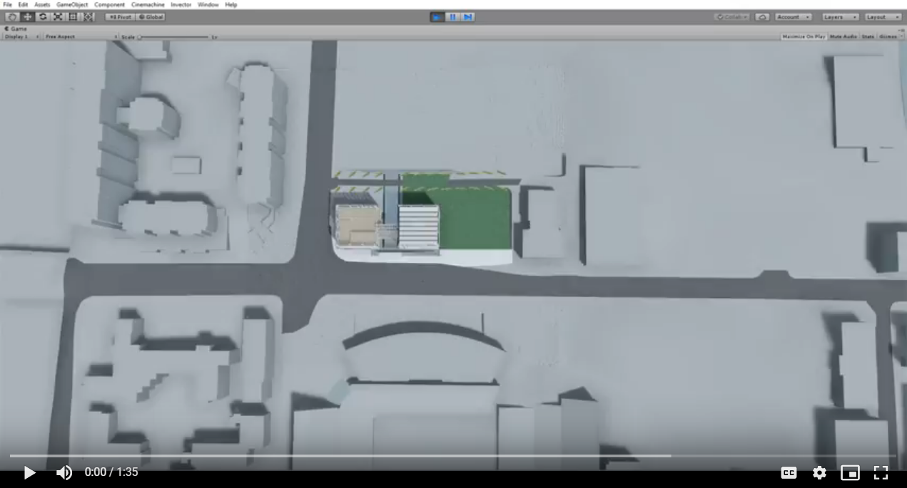

# Light Gallery
## Won Georgia Institute of Technology’s Capstone Expo (2018) with Best Overall Project in Architecture.
I created this animation using Unity 3D. Archicture majors designed the buildilng and I brought it into Unity and altered and improved it so that it would fit the animation well. The animation gives a tour of the two connected buildings. The intent of the buildings is to be a gallery for Gerhard Richer's art works. We played with glass, reflection, and lighting in order to create a museum suitable for his works.
## Video
Click to watch

